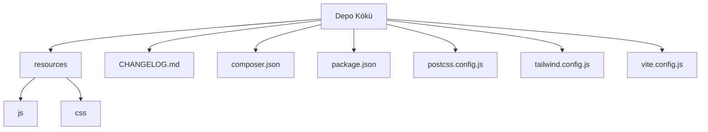

# Boya Etkinlik Platformu (Laravel 11)

Bu README dosyası, ücretsiz ve ücretli boyama sayfalarının listelendiği, satın alınabildiği ve token bazlı indirilebildiği "Boya Etkinlik Platformu" projesine genel bir bakış sunar. Proje, hedef kullanıcılarına dijital boyama içeriği sunmayı amaçlayan, yönetilebilir ve esnek bir yapıya sahip bir web uygulamasıdır. Geliştiriciler ve operatörler için kolay kurulum, yapılandırma ve dağıtım seçenekleri ile donatılmıştır.

## İçindekiler
* [Özet](#özet)
* [Özellikler](#özellikler)
* [Gereksinimler](#gereksinimler)
* [Kurulum ve çalıştırma](#kurulum-ve-çalıştırma)
* [Yapılandırma](#yapılandırma)
* [Kullanılan teknolojiler](#kullanılan-teknolojiler)
* [Mimari ve klasör yapısı](#mimari-ve-klasör-yapısı)
* [API veya uç noktalar](#api-veya-uç-noktalar)
* [Test ve kalite](#test-ve-kalite)
* [Dağıtım ve üretim notları](#dağıtım-ve-üretim-notları)
* [Katkıda bulunma](#katkıda-bulunma)
* [Lisans](#lisans)

## Özet
Bu proje, dijital boyama içeriği arayan kullanıcılara yönelik, hem ücretsiz hem de ücretli boyama sayfalarını barındıran bir platformun temel iskeletidir. Kullanıcılar platform üzerinden çeşitli boyama sayfalarını inceleyebilir, ücretli içerikleri satın alabilir ve tek kullanımlık tokenlar aracılığıyla indirebilirler. Temel amacı, sanatseverlere, ebeveynlere veya eğitimcilere yönelik geniş bir dijital boyama kaynağı sağlamak ve içeriğin güvenli bir şekilde dağıtımını sağlamaktır. Laravel 11 framework'ü üzerine inşa edilmiş olup, modern web standartlarına uygun, performanslı ve ölçeklenebilir bir yapı sunar.

## Özellikler
*   **Ücretsiz ve Ücretli İçerik Yönetimi:** Kullanıcılara sunulan boyama sayfalarını ücretsiz ve ücretli kategorilere ayırma yeteneği.
*   **Token Bazlı Güvenli İndirme:** Ücretli içeriklerin satın alma sonrası tek kullanımlık tokenlar ile güvenli bir şekilde indirilmesi.
*   **Varsayılan Yönetici Hesabı:** İlk kurulumda platform yönetimi için hazır, önceden tanımlı bir yönetici hesabı.
*   **Gelişmiş Ön Uç Geliştirme:** Tailwind CSS ile hızlı ve esnek stil yönetimi; Alpine.js ile hafif ve reaktif kullanıcı arayüzü etkileşimleri.
*   **Vite Entegrasyonu:** Geliştirme sürecini optimize eden ve üretim için varlık derlemesini hızlandıran Vite build aracı kullanımı.
*   **Shopier Ödeme Entegrasyonu:** Harici bir ödeme geçidi olan Shopier ile entegrasyon desteği (callback rotası belirtilmiştir).
*   **Güvenli Dosya Saklama:** Ücretli içeriklerin herkese açık olmayan `storage/app/private` dizininde, ücretsiz içeriklerin ise `storage/app/public/free-pages` altında saklanması.
*   **Paylaşımlı Hosting Optimizasyonları:** Paylaşımlı hosting ortamlarında performans ve güvenlik için özel yapılandırma notları ve ipuçları.
*   **Koyu Tema Desteği:** Kullanıcı deneyimini geliştiren ve özelleştirilebilir bir koyu tema modu.
*   **Sürüm Geçmişi Takibi:** `CHANGELOG.md` dosyası ile proje değişikliklerinin ve sürüm güncellemelerinin detaylı kaydı.
*   **Otomatik Varlık Yayınlama:** Composer scriptleri aracılığıyla Laravel varlıklarının otomatik olarak yayınlanması.
*   **PHP E-posta Desteği:** PHPMailer kütüphanesi ile zengin özellikli e-posta gönderimi.
*   **PDF Oluşturma Desteği:** `setasign/fpdf` kütüphanesi ile PDF dosyaları oluşturma yeteneği.

## Gereksinimler
Projenin sorunsuz çalışması için aşağıdaki yazılım ve servislerin kurulu olması gerekmektedir:

*   **PHP:** Minimum 8.2 sürümü (`composer.json`'da belirtilmiştir).
*   **Laravel Framework:** Minimum 11.31 sürümü (`composer.json`'da belirtilmiştir).
*   **Node.js:** `package.json` tarafından kullanılan NPM paketleri ve Vite için önerilen minimum sürüm 18.0.0 veya 20.0.0 veya 22.0.0.
*   **NPM veya Yarn:** Frontend bağımlılıklarını yönetmek için.
*   **Composer:** PHP bağımlılıklarını yönetmek için.
*   **İlişkisel Veritabanı:** MySQL, PostgreSQL veya SQLite gibi Laravel tarafından desteklenen bir veritabanı.

## Kurulum ve çalıştırma

Projeyi yerel ortamınızda kurmak ve çalıştırmak için aşağıdaki adımları izleyin:

1.  Depoyu klonlayın:
    ```bash
    git clone https://github.com/KULLANICI_ADINIZ/REPO_ADINIZ.git
    cd REPO_ADINIZ
    ```
2.  Ortam değişkenleri dosyasını oluşturun ve yapılandırın:
    ```bash
    cp .env.example .env
    ```
    `.env` dosyasını açarak veritabanı bağlantı bilgilerini ve diğer gerekli ortam değişkenlerini doldurun.
3.  Uygulama anahtarını oluşturun:
    ```bash
    php artisan key:generate
    ```
4.  PHP bağımlılıklarını yükleyin:
    ```bash
    composer install
    ```
5.  Veritabanı tablolarını oluşturun ve varsayılan verileri ekleyin:
    ```bash
    php artisan migrate --seed
    ```
6.  Node.js bağımlılıklarını yükleyin ve frontend varlıklarını derleyin:
    ```bash
    npm install
    npm run build
    ```
7.  Uygulamayı geliştirme modunda başlatın (sunucu, kuyruk dinleyicisi, log izleyicisi ve Vite dahil):
    ```bash
    composer dev
    ```
    Bu komut, eş zamanlı olarak `php artisan serve`, `php artisan queue:listen`, `php artisan pail` ve `npm run dev` komutlarını çalıştırır.

Varsayılan yönetici hesabı bilgileri:
*   **E-posta:** `admin@boyaetkinlik.test`
*   **Şifre:** `12345678`

## Yapılandırma
Projenin temel yapılandırmaları `.env` dosyası üzerinden yapılmaktadır. İşte bazı önemli değişkenler:

| Değişken    | Açıklama                                                       | Zorunlu      |
| :---------- | :------------------------------------------------------------- | :----------- |
| `APP_ENV`   | Uygulama ortamı (örneğin `local`, `production`).              | Evet         |
| `APP_DEBUG` | Hata ayıklama modunu etkinleştirir veya devre dışı bırakır.  | Evet         |
| `APP_URL`   | Uygulamanın temel URL'si (ör. `https://boyaetkinlik.com`).    | Evet         |
| `DB_CONNECTION` | Veritabanı bağlantı sürücüsü (ör. `mysql`, `sqlite`).         | Evet         |
| `DB_HOST`, `DB_PORT`, `DB_DATABASE`, `DB_USERNAME`, `DB_PASSWORD` | Veritabanı bağlantı detayları. | Evet         |
| `QUEUE_CONNECTION` | Kuyruk sürücüsü (ör. `database`, `redis`, `sync`).           | Evet         |
| `CACHE_DRIVER` | Önbellek sürücüsü (ör. `file`, `redis`, `database`).          | Evet         |
| `MAIL_MAILER`, `MAIL_HOST`, `MAIL_PORT`, `MAIL_USERNAME`, `MAIL_PASSWORD`, `MAIL_ENCRYPTION`, `MAIL_FROM_ADDRESS`, `MAIL_FROM_NAME` | E-posta gönderimi için SMTP sunucu bilgileri. | İsteğe bağlı |

## Kullanılan teknolojiler
Bu proje, modern web geliştirme standartlarına uygun olarak çeşitli teknolojiler kullanmaktadır:

*   **Arka Uç (Backend)**
    *   **Dil:** PHP (sürüm 8.2+)
    *   **Framework:** Laravel (sürüm 11.31+)
    *   **PHP Kütüphaneleri (`composer.json`):**
        *   `laravel/framework`: Laravel ana iskeleti.
        *   `laravel/tinker`: Laravel Artisan konsolu için interaktif ortam.
        *   `phpmailer/phpmailer`: E-posta gönderme kütüphanesi.
        *   `setasign/fpdf`: PDF belgeleri oluşturma kütüphanesi.
        *   `fakerphp/faker` (dev): Sahte veri oluşturma.
        *   `laravel/pail` (dev): Konsol log izleyici.
        *   `laravel/pint` (dev): PHP kod stil düzenleyici.
        *   `laravel/sail` (dev): Laravel için Docker geliştirme ortamı.
        *   `mockery/mockery` (dev): PHP testleri için mock nesneleri oluşturma.
        *   `nunomaduro/collision` (dev): CLI hata raporlama aracı.
        *   `phpunit/phpunit` (dev): PHP birim test framework'ü.
*   **Ön Uç (Frontend)**
    *   **JavaScript Framework/Kütüphanesi:** Alpine.js (sürüm 3.15.11+)
    *   **CSS Framework:** Tailwind CSS (sürüm 3.4.13+)
    *   **Modül Paketleyici/Derleyici:** Vite (sürüm 6.0.11+)
    *   **Node.js Kütüphaneleri (`package.json`):**
        *   `axios`: HTTP istemcisi.
        *   `concurrently`: Birden fazla komutu eş zamanlı çalıştırma.
        *   `laravel-vite-plugin`: Laravel ile Vite entegrasyonu.
        *   `postcss`: CSS dönüştürme aracı.
        *   `autoprefixer`: CSS'e tarayıcı ön ekleri ekleme.

## Mimari ve klasör yapısı
Proje, Laravel'in standart dizin yapısını takip eden katmanlı bir mimariye sahiptir. Bu yapı, sorumlulukları ayırarak kodun okunabilirliğini ve bakımını kolaylaştırır. `resources` klasörü, uygulamanın ön uç varlıklarını (CSS ve JavaScript) barındırırken, ana iş mantığı Laravel'in tipik `app/` dizininde yer alır. Veritabanı geçişleri, tohumlayıcılar ve modeller gibi bileşenler Laravel'in alışılagelmiş düzeninde bulunur.

Uygulama, temel olarak bir Model-View-Controller (MVC) desenine uygun olarak tasarlanmıştır. Veritabanı etkileşimleri modeller aracılığıyla, kullanıcı arayüzü Blade şablonları (muhtemelen `resources/views` altında bulunur) ve CSS/JS varlıkları ile sağlanır. Frontend tarafında Tailwind CSS ile hızlı UI geliştirme ve Alpine.js ile hafif reaktiflik entegre edilmiştir.

| Bölüm / klasör      | Kısa açıklama                                         |
| :------------------ | :---------------------------------------------------- |
| `resources`         | Ön uç (frontend) varlıkları (CSS, JavaScript).        |
| `resources/css`     | Tailwind CSS ve özel stiller için CSS dosyaları.      |
| `resources/js`      | Uygulama JavaScript'i ve bağımlılıkları.              |
| `CHANGELOG.md`      | Projenin sürüm geçmişi ve değişiklik notları.         |
| `README.md`         | Proje hakkında genel bilgiler ve dokümantasyon.       |
| `composer.json`     | PHP bağımlılıkları ve Composer komutları.             |
| `package-lock.json` | Node.js bağımlılıklarının kilit dosyası.              |
| `package.json`      | Node.js bağımlılıkları ve NPM/Yarn komutları.         |
| `postcss.config.js` | PostCSS yapılandırma dosyası (Tailwind, Autoprefixer).|
| `tailwind.config.js`| Tailwind CSS özel tema ve eklenti yapılandırması.     |
| `vite.config.js`    | Vite derleme aracı yapılandırması.                    |



## API veya uç noktalar
Bu projede bağlamda açıkça belirtilen ve genel Laravel kalıplarına dayalı olarak tahmin edilen bazı temel uç noktalar:

*   **Shopier Callback Rotası:**
    *   `POST /shopier/callback`: Shopier ödeme sisteminden gelen bildirimleri işleyen rota. Ödeme başarılı olduğunda işlem `paid` olarak işaretlenir, tek kullanımlık indirme tokeni üretilir ve kullanıcıya e-posta ile indirme linki gönderilir.
*   **Kullanıcı Kimlik Doğrulama Rotları:**
    *   `/login`: Kullanıcı girişi için.
    *   `/register`: Yeni kullanıcı kaydı için.
    *   `/logout`: Kullanıcı çıkışı için.
    *   `/forgot-password`: Şifre sıfırlama talepleri için.
*   **İçerik Görüntüleme Rotları:**
    *   `/pages`: Tüm boyama sayfalarını listeleme.
    *   `/pages/{id}`: Belirli bir boyama sayfasının detaylarını görüntüleme.
*   **Yönetim Paneli Rotları:**
    *   `/admin`: Yönetim paneli girişi ve ana ekranı (kimlik doğrulama gerektirir).
    *   `/admin/pages`: Boyama sayfalarını yönetme (ekleme, düzenleme, silme).

## Test ve kalite
Projenin kalitesini sağlamak için çeşitli test ve kod kalitesi araçları entegre edilmiştir.

*   **PHP Testleri:**
    *   `phpunit/phpunit` paketi kullanılarak PHP birim ve özellik testleri yapılmaktadır. `composer.json` içindeki `require-dev` bölümünde belirtilmiştir.
    *   `laravel/sail` sayesinde Docker ortamında testler kolayca çalıştırılabilir.
*   **Kod Stili ve Biçimlendirme:**
    *   `laravel/pint` kullanılarak PHP kodları otomatik olarak PSR-12 standartlarına uygun biçimde düzenlenebilir.
        *   `composer pint`: Kod stilini otomatik düzeltmek için kullanılabilir (önerilir).
*   **Frontend Testleri ve Linting:**
    *   `package.json` içinde doğrudan test komutu belirtilmemiştir. Ancak, JavaScript kod kalitesini artırmak için ESLint gibi araçların entegre edilmesi önerilir.
    *   Derleme süreci `npm run build` komutu ile Vite aracılığıyla yönetilmektedir.

## Dağıtım ve üretim notları
Projenin üretim ortamında dağıtımı ve optimizasyonu için aşağıdaki notlara dikkat edilmesi önemlidir:

**Ortam Değişkenleri:**
Üretim ortamında `.env` dosyasında `APP_ENV=production` ve `APP_DEBUG=false` olarak ayarlanmalıdır. `APP_URL` değişkeni, uygulamanızın canlı adresini (`https://boyaetkinlik.com` gibi, sonunda `/` olmadan) tam olarak içermelidir. HTTP'den HTTPS'e ve `www`'den ana domaine yönlendirmeler `public/.htaccess` dosyası ve/veya CDN (örn. Cloudflare) ile yönetilmelidir.

**Kuyruk ve Önbellek Sürücüleri:**
Üretim için kuyruk (queue) ve önbellek (cache) sürücüleri olarak `database` veya `file` kullanılması önerilir. Daha yüksek performans gerektiren durumlarda Redis veya Memcached gibi çözümler değerlendirilmelidir.

**Dosya Depolama:**
Ücretli dosyalar `storage/app/private` altında, herkese açık erişim olmadan saklanır. Ücretsiz dosyalar `storage/app/public/free-pages` altında bulunur. `public/storage` dizini, `storage/app/public` içeriğine sembolik bir bağlantı olmalıdır.

**Sembolik Bağlantı Sorunları (Paylaşımlı Hosting):**
Eğer paylaşımlı hosting ortamında `php artisan storage:link` komutu sembolik bağlantı oluşturmazsa:
1.  `storage/app/public` içeriklerini manuel olarak `public/storage` altına kopyalayın.
2.  Yükleme stratejinizi (deploy betiklerini) bu durumu dikkate alarak güncelleyin ve dosya senkronizasyonunu sağlayın.

**Hosting Sağlayıcıya Özel Notlar (Hostinger & Cloudflare):**
Mevcut `README.md` dosyasında Hostinger (hPanel) ve Cloudflare (ad sunucuları Cloudflare ise) için özel SSL, yönlendirme ve tek adres ayarları detaylı olarak açıklanmıştır. Bu talimatlar, HTTPS'ye zorlama, `www` ön ekini kaldırma ve "too many redirects" sorunlarını giderme konularında kritik adımlar içermektedir. Üretim ortamında bu yönergelerin dikkatlice takip edilmesi, uygulamanın doğru ve güvenli bir şekilde erişilebilir olmasını sağlayacaktır.

## Katkıda bulunma
Projeye katkıda bulunmaktan mutluluk duyarız. Her türlü hata raporu, özellik talebi veya kod katkısı değerlidir. Lütfen bir Pull Request göndermeden önce mevcut `CHANGELOG.md` dosyasını inceleyerek son değişikliklerden haberdar olun ve kod katkılarınızın mevcut standartlara (ör. `pint` ile PHP kod stili) uygun olduğundan emin olun. Daha detaylı katkı yönergeleri için `CONTRIBUTING.md` dosyasının eklenmesi önerilir.

## Lisans
Bu proje MIT Lisansı altında yayınlanmıştır. Daha fazla bilgi için `composer.json` dosyasına bakabilirsiniz.