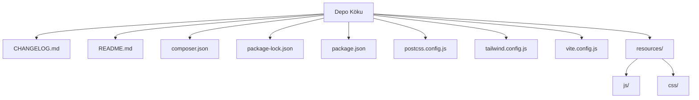

# Boya Etkinlik Platformu

Bu README dosyası, Boya Etkinlik Platformu projesinin kurulumu, yapılandırması, mimarisi ve dağıtımına yönelik kapsamlı bilgiler sunar. Proje, kullanıcılara hem ücretsiz hem de ücretli boyama sayfaları sunarak dijital ürünlerin listelenmesini, satın alınmasını ve token bazlı güvenli bir şekilde indirilmesini sağlayan bir web uygulaması iskeletidir. Odak noktası, kullanıcı dostu bir arayüz ve ürün yönetimi sunarken, Laravel 11'in modern özelliklerinden faydalanmaktır.

## İçindekiler
* [Özet](#özet)
* [Özellikler](#özellikler)
* [Gereksinimler](#gereksinimler)
* [Kurulum ve çalıştırma](#kurulum-ve-çalıştırma)
* [Yapılandırma](#yapılandırma)
* [Kullanılan teknolojiler](#kullanılan-teknolojiler)
* [Mimari ve klasör yapısı](#mimari-ve-klasör-yapısı)
* [API veya uç noktalar](#api-veya-uç-noktalar)
* [Test ve kalite](#test-ve-kalite)
* [Dağıtım ve üretim notları](#dağıtım-ve-üretim-notları)
* [Katkıda bulunma](#katkıda-bulunma)
* [Lisans](#lisans)

## Özet
Boya Etkinlik Platformu, dijital boyama sayfalarını barındıran ve dağıtan bir e-ticaret altyapısıdır. Hedef kullanıcı kitlesi, yaratıcı içerik arayan bireyler ve dijital boyama sayfaları sunmak isteyen içerik üreticileridir. Proje, kullanıcılara çeşitli ücretsiz ve ücretli boyama sayfalarını kolayca keşfetme ve satın alma imkanı sunar. Ana işlevleri arasında ürün listeleme, güvenli ödeme işlemleri (Shopier entegrasyonu ile), ödeme sonrası tek kullanımlık indirme tokenları üretimi ve kullanıcılara indirme bağlantılarının e-posta ile gönderilmesi yer almaktadır. Ayrıca, Tailwind CSS ve Alpine.js ile modern bir kullanıcı deneyimi hedeflenmektedir.

## Özellikler
*   Ücretsiz ve ücretli dijital boyama sayfaları listeleme.
*   Shopier ödeme ağ geçidi ile güvenli ödeme işlemleri.
*   Ödeme sonrası benzersiz, tek kullanımlık indirme tokenı oluşturma.
*   Kullanıcılara e-posta ile indirme bağlantıları gönderme yeteneği.
*   Varsayılan admin hesabı ile kolay başlangıç ve yönetim.
*   Laravel 11 tabanlı sağlam ve sürdürülebilir bir arka uç.
*   Tailwind CSS ile hızlı ve özelleştirilebilir bir arayüz.
*   Alpine.js ile hafif ve reaktif ön uç etkileşimleri.
*   Vite ile hızlı geliştirme ve derleme süreçleri.
*   Paylaşımlı hosting ortamları için özel dağıtım notları.
*   Temiz ve modüler kod yapısı sayesinde kolay genişletilebilirlik.
*   Güncel sürüm notları (`CHANGELOG.md`) ile proje gelişimi takibi.

## Gereksinimler
Projenin düzgün çalışması için aşağıdaki gereksinimler karşılanmalıdır:

*   **PHP:** Sürüm 8.2 veya üzeri (`composer.json` gereksinimlerine göre).
*   **Node.js:** Vite ve npm bağımlılıkları için Node.js 18.0.0 veya üzeri (`package.json` ve `vite.config.js` referanslarına göre).
*   **Composer:** PHP bağımlılıklarını yönetmek için.
*   **npm:** JavaScript bağımlılıklarını yönetmek için.
*   **Veritabanı:** MySQL, PostgreSQL, SQLite veya başka bir desteklenen veritabanı (Laravel tarafından desteklenen).
*   **E-posta Servisi:** Kullanıcılara indirme linkleri göndermek için yapılandırılmış bir e-posta servisi (örneğin PHPMailer kullanılabilir).

## Kurulum ve çalıştırma

Projeyi yerel ortamınızda kurmak ve çalıştırmak için aşağıdaki adımları izleyin:

1.  **Depoyu klonlayın:**
    ```bash
    git clone https://github.com/KULLANICI_ADINIZ/boya-etkinlik-platformu.git
    cd boya-etkinlik-platformu
    ```
    *Not: Depo URL'si varsayımsaldır; kendi repo URL'nizle güncelleyin.*
2.  **Ortam değişkenlerini yapılandırın:**
    ```bash
    cp .env.example .env
    ```
    `.env` dosyasını açarak veritabanı bağlantı bilgilerini ve diğer uygulama ayarlarını (örneğin `APP_URL`) doldurun.
3.  **Uygulama anahtarını oluşturun:**
    ```bash
    php artisan key:generate
    ```
4.  **PHP bağımlılıklarını kurun:**
    ```bash
    composer install
    ```
5.  **Veritabanı tablolarını oluşturun ve varsayılan verileri doldurun:**
    ```bash
    php artisan migrate --seed
    ```
    Bu komut, veritabanınızı oluşturacak ve varsayılan admin kullanıcı gibi başlangıç verilerini ekleyecektir.
6.  **JavaScript bağımlılıklarını kurun ve ön uç varlıklarını derleyin:**
    ```bash
    npm install
    npm run build
    ```
7.  **Uygulamayı geliştirme modunda başlatın (isteğe bağlı):**
    `composer.json` içindeki `dev` script'ini kullanarak Laravel geliştirme sunucusunu, kuyruk dinleyicisini, log izleyicisini ve Vite'ı aynı anda başlatabilirsiniz:
    ```bash
    composer dev
    ```
    Veya ayrı ayrı çalıştırmak isterseniz:
    ```bash
    php artisan serve
    npm run dev
    ```
    Uygulama genellikle `http://127.0.0.1:8000` adresinde erişilebilir olacaktır.

**Varsayılan Admin Bilgileri:**
*   E-posta: `admin@boyaetkinlik.test`
*   Şifre: `12345678`

## Yapılandırma
Projenin yapılandırma ayarları `.env` dosyasında tutulur. Aşağıda öne çıkan bazı değişkenler listelenmiştir:

| Değişken    | Açıklama                                                       | Zorunlu      |
|-------------|----------------------------------------------------------------|--------------|
| `APP_ENV`   | Uygulama ortamı (`local`, `production`, `testing` vb.).        | Evet         |
| `APP_DEBUG` | Uygulama hata ayıklama modunun açık olup olmadığı (`true`/`false`). | Evet         |
| `APP_URL`   | Uygulamanızın tam URL'si (ör. `https://boyaetkinlik.com`).      | Evet         |
| `DB_CONNECTION` | Veritabanı bağlantı sürücüsü (ör. `mysql`, `sqlite`).         | Evet         |
| `DB_HOST`   | Veritabanı sunucusu.                                           | Evet         |
| `DB_PORT`   | Veritabanı portu.                                              | Evet         |
| `DB_DATABASE` | Kullanılacak veritabanının adı.                                | Evet         |
| `DB_USERNAME` | Veritabanı kullanıcı adı.                                      | Evet         |
| `DB_PASSWORD` | Veritabanı parolası.                                           | Evet         |
| `MAIL_MAILER` | E-posta gönderim sürücüsü (ör. `smtp`, `sendmail`).           | Evet         |
| `MAIL_HOST` | E-posta sunucu adresi.                                         | Evet         |
| `MAIL_PORT` | E-posta sunucu portu.                                          | Evet         |
| `MAIL_USERNAME` | E-posta kullanıcı adı.                                       | Evet         |
| `MAIL_PASSWORD` | E-posta parolası.                                            | Evet         |
| `MAIL_ENCRYPTION` | E-posta şifreleme türü (ör. `tls`, `ssl`).                 | İsteğe bağlı |
| `MAIL_FROM_ADDRESS` | Gönderen e-posta adresi.                                | Evet         |
| `MAIL_FROM_NAME` | Gönderen adı.                                                | Evet         |
| `SHOPIER_API_KEY` | Shopier API anahtarınız.                                     | Evet         |
| `SHOPIER_SECRET` | Shopier gizli anahtarınız.                                   | Evet         |

*Önemli: `SHOPIER_API_KEY` ve `SHOPIER_SECRET` gibi hassas bilgileri doğrudan `.env` dosyasına yazın ve bu dosyayı versiyon kontrolüne (git vb.) eklemeyin. `.env.example` dosyasını şablon olarak kullanın.*

## Kullanılan teknolojiler
*   **PHP:** 8.2+
*   **Laravel Framework:** 11.31+
*   **JavaScript (ES6+)**
*   **Node.js:** 18+
*   **npm**
*   **Vite:** 6.0.11+ (Ön uç derleme aracı)
*   **Tailwind CSS:** 3.4.13+ (CSS Framework)
*   **Alpine.js:** 3.15.11+ (Hafif JavaScript Framework)
*   **Axios:** 1.7.4+ (HTTP istemcisi)
*   **PHPMailer:** 7.0+ (E-posta gönderim kütüphanesi)
*   **Setasign FPDF:** 1.8+ (PDF oluşturma kütüphanesi)
*   **Composer:** PHP bağımlılık yöneticisi

## Mimari ve klasör yapısı
Bu proje, modern bir web uygulaması geliştirmek için standart Laravel yapısını takip etmektedir. `resources/js` ve `resources/css` gibi klasörler, ön uç varlıklarının (JavaScript, CSS) düzenli bir şekilde tutulmasını sağlar. `public` dizini, web sunucusu tarafından doğrudan erişilebilen tüm varlıkları (derlenmiş CSS/JS, resimler vb.) içerir. Laravel'in MVC (Model-View-Controller) deseni, uygulamanın iş mantığını, veri yönetimini ve kullanıcı arayüzünü ayırarak kodun okunabilirliğini ve bakımını kolaylaştırır. Özellikle `storage/app/private` ücretli dosyaların, `storage/app/public/free-pages` ise ücretsiz dosyaların saklandığı konumlar olarak belirtilmiştir.

Projenin temel klasör ve dosya yapısı aşağıdaki gibidir:

| Bölüm / klasör       | Kısa açıklama                                                              |
|----------------------|----------------------------------------------------------------------------|
| `CHANGELOG.md`       | Projenin sürüm notlarını ve değişiklik geçmişini içerir.                     |
| `README.md`          | Proje hakkında genel bilgi, kurulum ve kullanım talimatları.               |
| `composer.json`      | PHP bağımlılıklarını ve Composer script'lerini tanımlar.                   |
| `package-lock.json`  | npm bağımlılık ağacının kesin durumunu kilitler.                           |
| `package.json`       | JavaScript bağımlılıklarını ve npm script'lerini tanımlar.                 |
| `postcss.config.js`  | PostCSS yapılandırma dosyası (Tailwind CSS ve Autoprefixer için).        |
| `resources/`         | Uygulamanın ham ön uç varlıklarını (CSS, JavaScript, Blade şablonları) içerir. |
| `resources/css/`     | Uygulamanın stil dosyalarını (ör. `app.css`) içerir.                      |
| `resources/js/`      | Uygulamanın JavaScript dosyalarını (ör. `app.js`, `bootstrap.js`) içerir. |
| `tailwind.config.js` | Tailwind CSS çerçevesinin özelleştirme yapılandırması.                     |
| `vite.config.js`     | Vite ön uç derleme aracının yapılandırması.                                |



## API veya uç noktalar
Bu projede tanımlanan ana uç nokta (endpoint):

*   **`POST /shopier/callback`**: Shopier ödeme ağ geçidinden gelen bildirimleri işlemek için kullanılan rota. Bu uç nokta, ödeme başarılı olduğunda işlemi `paid` olarak işaretler, tek kullanımlık indirme tokenı üretir ve kullanıcıya indirme bağlantısını e-posta ile gönderir.

Diğer Laravel uygulamalarında olduğu gibi, kullanıcı kimlik doğrulama, ürün listeleme, sepet yönetimi ve dosya indirme gibi standart web rotalarının da mevcut olması beklenir.

## Test ve kalite
Bu depoda Laravel'in varsayılan test araçları mevcuttur.

*   **PHP Birim Testleri:** PHPUnit (`phpunit/phpunit`) kullanılarak PHP tabanlı testler yazılabilir. `composer.json` dosyasında `phpunit/phpunit:^11.0.1` bağımlılığı tanımlıdır.
*   **PHP Kod Stili:** Laravel Pint (`laravel/pint`) kullanılarak PHP kodunuzun otomatik olarak biçimlendirilmesi ve kod standardının korunması sağlanabilir. `composer.json` dosyasında `laravel/pint:^1.13` bağımlılığı tanımlıdır.

Testleri çalıştırmak için `composer.json` içinde doğrudan bir test script'i tanımlanmamıştır, ancak aşağıdaki komutlar kullanılabilir:
*   PHP birim testlerini çalıştırmak için:
    ```bash
    ./vendor/bin/phpunit
    ```
*   PHP kod stilini kontrol etmek ve düzeltmek için:
    ```bash
    ./vendor/bin/pint
    ```

Gelecekte daha kapsamlı test ve kalite süreçleri için `package.json`'a ek linting veya e2e (uçtan uca) test komutlarının eklenmesi önerilir.

## Dağıtım ve üretim notları
Projenin üretime dağıtımı için aşağıdaki noktalara dikkat edilmesi önerilir:

1.  **Ortam Değişkenleri:** `.env` dosyasındaki `APP_ENV` değişkenini `production` ve `APP_DEBUG` değişkenini `false` olarak ayarlayın. `APP_URL` değerinin canlı site adresinizi (`https://boyaetkinlik.com` gibi, sonunda `/` olmadan) doğru bir şekilde yansıttığından emin olun.
2.  **Kuyruk ve Önbellek:** Üretim ortamında performans için kuyruk (`queue`) ve önbellek (`cache`) sürücülerini `database` veya `file` yerine Redis veya Memcached gibi daha performanslı çözümlerle yapılandırmanız önerilir. Mevcut bağlamda `database` veya `file` olarak ayarlanabileceği belirtilmiştir.
3.  **Güvenli Depolama:** Ücretli dosyalar `storage/app/private` altında tutulmalı ve doğrudan web erişimine kapalı olmalıdır. Ücretsiz dosyalar `storage/app/public/free-pages` altında saklanabilir.
4.  **Sembolik Bağlantılar (`storage:link`):** `php artisan storage:link` komutu, `public/storage` dizinine `storage/app/public` için sembolik bir bağlantı oluşturur. Bazı paylaşımlı hosting sağlayıcılarında bu işlem desteklenmeyebilir. Eğer sembolik bağlantılar çalışmazsa, `storage/app/public` içeriğini manuel olarak `public/storage` altına kopyalayın ve yükleme stratejinizi buna göre güncelleyin.
5.  **Hosting Özel Ayarları:**
    *   **Hostinger (hPanel):** SSL sertifikasının etkin olduğundan ve "HTTPS'e yönlendir" seçeneğinin açık olduğundan emin olun. `public/.htaccess` dosyasının güncel ve HTTPS'e yönlendirme kurallarını içerdiğini doğrulayın. `APP_URL` ayarını güncelledikten sonra `php artisan config:clear` komutuyla önbelleği temizleyin.
    *   **Cloudflare:** Eğer Cloudflare ad sunucuları kullanılıyorsa, SSL/TLS ayarlarını "Full (strict)" veya "Full" olarak yapılandırın. "Always Use HTTPS" özelliğini etkinleştirin ve `www` adresini ana domaine yönlendiren bir kural (`www to apex`) oluşturun. Sunucudaki `.env` ve `.htaccess` ayarlarının Cloudflare ile uyumlu olduğundan emin olun.

## Katkıda bulunma
Bu projenin gelişimine katkıda bulunmak isteyen herkesi memnuniyetle karşılarız. Lütfen yeni özellikler veya hata düzeltmeleri için bir "issue" açarak önerilerinizi belirtin veya doğrudan bir "pull request" gönderin. Kod standartlarına uymaya ve mevcut testleri geçmeye özen gösteriniz.

## Lisans
Bu proje, `composer.json` dosyasında belirtildiği üzere **MIT Lisansı** ile lisanslanmıştır. Daha detaylı bilgi için lütfen projenin kök dizinindeki lisans dosyasına bakınız (ancak bu depoda `LICENSE` adında bir dosya doğrulanamadı; eklenmesi önerilir).